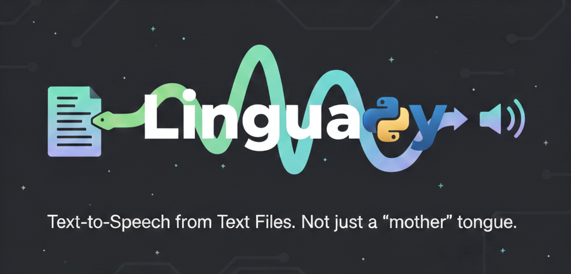

# 🎙️ LinguaPy



> Converta arquivos de texto em áudios de forma simples e automática usando Google Text-to-Speech

[](https://www.python.org/downloads/)
[](https://pypi.org/project/gTTS/)

## 📋 Sobre o Projeto

Este projeto automatiza a conversão de arquivos de texto (TXT) em áudios MP3 usando a biblioteca gTTS (Google Text-to-Speech). Cada linha do arquivo é processada individualmente, gerando um arquivo de áudio correspondente com nome baseado no conteúdo da frase.

### ✨ Funcionalidades

- 🎯 **Conversão linha por linha** - Processa cada frase independentemente
- 🧹 **Limpeza automática de HTML** - Remove tags HTML antes de gerar os áudios
- 🌍 **Suporte multilíngue** - Compatível com diversos idiomas (inglês, português, espanhol, etc.)
- 📁 **Organização automática** - Cria pasta de saída e nomeia arquivos inteligentemente
- 🚀 **Gratuito e sem limites** - Não requer API keys ou cadastros
- ⚡ **Rápido e eficiente** - Processamento em lote otimizado

## 🚀 Começando

### Pré-requisitos

- Python 3.7 ou superior
- pip (gerenciador de pacotes Python)

### 📦 Instalação

1. **Clone o repositório**

```bash
git clone https://github.com/mpaullos/linguapy.git
cd linguapy
```

2. **Crie um ambiente virtual (recomendado)**

```bash
python -m venv venv
source venv/bin/activate  # No Windows: venv\Scripts\activate
```

3. **Instale as dependências**

```bash
pip install -r ./requirements.txt
```

## 📖 Como Usar

### 1️⃣ Prepare seu arquivo de texto

No arquivo `frases.txt` insira as suas frases para conversão):
Ex:

```
He wears a straw hat on hot days.
She loves to read books in the library.
The cat is <strong>sleeping</strong> on the couch.
```

### 2️⃣ Execute o script

```bash
python lingua.py
```

### 3️⃣ Encontre seus áudios

Os arquivos MP3 estarão na pasta `audios_gerados/`:

- `He wears a straw hat on ho.mp3`
- `She loves to read books in .mp3`
- `The cat is sleeping on the .mp3`

## 📂 Estrutura do Projeto

```
linguapy/
│
├── lingua.py              # Script principal
├── frases.txt             # Arquivo de entrada (frases de exemplo)
├── audios_gerados/        # Pasta com áudios gerados
├── README.md              # Este arquivo
├── banner.png             # Banner do projeto
└── requirements.txt       # Dependências do projeto
```

## 🛠️ Funções Principais

### `processar_txt_para_tts()`

Processa o arquivo TXT e gera os áudios.

### `remove_html_txt()`

Remove tags HTML das frases antes da conversão.

### `limpar_nome_arquivo()`

Cria nomes de arquivo válidos a partir das frases.

### `atualizar_txt_sem_html()`

Atualiza o arquivo TXT removendo tags HTML.

## 👤 Autor

Feito com ❤️ por [Marcos Paulo](https://github.com/mpaullos)

## 🙏 Agradecimentos

- [gTTS](https://github.com/pndurette/gTTS) - Biblioteca Google Text-to-Speech
